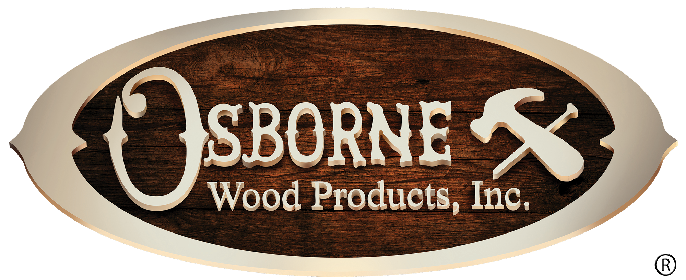

<p align="center"></p>

<h1 align="center">Osborne Api Plugin</h1>

Craft 3 plugin to interface with the Osborne Wood ERP API.

## Requirements

This plugin requires Craft CMS 3.3.0 or later as well as Craft Commerce 2.2.0 or later.

## API Specs

Swagger API Specs are available at https://app.swaggerhub.com/apis/jordan-hoff

## Installation

Because this repository is private, it is not registered on Packagist. You will need to add a repository reference to your project's `composer.json` file first:

```json
  "repositories": [
    {
      "type": "vcs",
      "url": "https://github.com/happycog/osborne-api-plugin.git"
    }
  ]
```

Then, use composer to require the most recent version of the plugin and install it in craft

```bash
composer require happycog/osborne-api-plugin

./craft install/plugin osborne-api-plugin
```

## Code Generation

This library uses code generated with [Swagger Codegen](https://swagger.io/tools/swagger-codegen/). There are two scripts included to generate both the production client as well as unit test fixtures.

### Production Client

Client code is generated from [https://api.swaggerhub.com/apis/jordan-hoff/osborne_erp_service_api/1.0.3](https://app.swaggerhub.com/apis/jordan-hoff/osborne_erp_service_api/1.0.3). To re-generate, remove the `generated` folder and run the `generate-client.sh` script:

```bash
rm -rf ./generated

./generate-client.sh
```

Note: If the schema version is updated, the `generate-client.sh` script needs to be updated accordingly.

### Unit Test Fixtures

Similar to the client code, there are test fixtures generated from [https://api.swaggerhub.com/apis/jordan-hoff/test_fixtures/1.0.0](https://app.swaggerhub.com/apis/jordan-hoff/test_fixtures/1.0.0). To re-generate, remove the `tests/Fixtures/Generated` folder and run the `generate-fixtures.sh` script:

```bash
rm -rf ./tests/Fixtures/Generated

./generate-fixtures.sh
```

Note: If the schema version is updated, the `generate-fixtures.sh` script needs to be updated accordingly.

## Usage

The swagger generated code leaves a little to be desired, so it has been extended to support an interface that is inspired by [Laravel Eloquent](https://laravel.com/docs/5.8/eloquent). This will abstract most of the logic needed to interact with the API, and allows the developer to focus on writing clean, organized code.

> Note: Currently only basic CRUD operations are supported. No filtering / pagination / etc.

Interaction with the API is handled through classes that extend `HappyCog\OsborneApi\ErpService\Model`.

### Model Operations

#### Get all models

Use the `all` method to get an array of models:

```php
use HappyCog\OsborneApi\ErpService\Model\Customer;

$customers = Customer::all();

foreach ($customers as $customer) {
    echo $customer->firstName;
}
```

#### Find a specific model

Use the `find` method to get a model:

```php
use HappyCog\OsborneApi\ErpService\Model\Customer;

$customer = Customer::find(123);

echo $customer->firstName;
```

#### Create a model instance

Use the `create` method to create a model:

```php
use HappyCog\OsborneApi\ErpService\Model\Customer;

$customer = Customer::create([
    'firstName' => 'foobar',
]);
```

#### Save a model instance

Use the `save` method to create a new model or save an existing one:

```php
use HappyCog\OsborneApi\ErpService\Model\Customer;

$customer = new Customer([
    'firstName' => 'foobar',
]);

$customer->save();

// OR

$customer = Customer::find(123);

$customer->firstName = 'foobar';

$customer->save();
```

#### Update a model instance

Use the `update` method to save changes to an existing model:

```php
use HappyCog\OsborneApi\ErpService\Model\Customer;

$customer = Customer::find(123);

$customer->update([
    'firstName' => 'foobar',
]);
```

#### Delete a model instance

Use the `delete` method to delete an existing model:

```php
use HappyCog\OsborneApi\ErpService\Model\Customer;

$customer = Customer::find(123);

$customer->delete();
```

#### Destroy a model instance

Use the `destroy` method to delete a model by id:

```php
use HappyCog\OsborneApi\ErpService\Model\Customer;

Customer::destroy(123);
```

